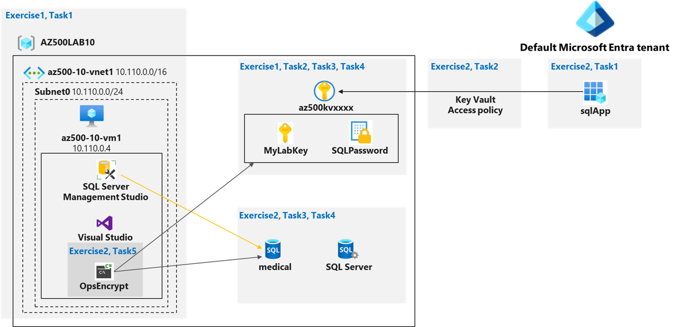

---
lab:
  title: 07 - Key Vault (implementazione di dati protetti con la configurazione di Always Encrypted)
  module: Module 01 - Implement and manage enforcement of cloud governance policies
---

# Lab 07: Key Vault (implementazione di dati protetti con la configurazione di Always Encrypted)

# Manuale del lab per gli studenti

## Scenario laboratorio

Viene chiesto di creare un'applicazione modello di verifica che usi il supporto di Database SQL di Azure per la funzionalità Always Encrypted. Tutti i segreti e le chiavi usati in questo scenario devono essere archiviati in Key Vault. L'applicazione deve essere registrata in Microsoft Entra ID per migliorarne la postura di sicurezza. Per raggiungere questi obiettivi, il modello di verifica deve includere queste attività:

- Creare un'istanza di Azure Key Vault e archiviare chiavi e segreti nell'insieme di credenziali.
- Creare un database SQL e crittografare il contenuto delle colonne nelle tabelle di database usando Always Encrypted.

>**Nota**: per tutte le risorse di questo lab viene usata l'area **Stati Uniti orientali**. Verificare con il docente che questa sia l'area da usare per il corso. 

Per concentrarsi sugli aspetti della sicurezza di Azure correlati alla creazione di questo modello di verifica, si inizierà con la distribuzione automatizzata di un modello di ARM, configurando una macchina virtuale con Visual Studio 2019 e SQL Server Management Studio 19.

## Obiettivi del lab

In questo lab verranno completati gli esercizi seguenti:

- Esercizio 1: Distribuire l'infrastruttura di base da un modello di ARM
- Esercizio 2: Configurare la risorsa Key Vault con una chiave e un segreto
- Esercizio 3: Configurare un database SQL Azure e un'applicazione basata sui dati
- Esercizio 4: Illustrare l'uso di Azure Key Vault crittografando il database SQL di Azure

## Diagramma di Key Vault



## Istruzioni

## File del lab:

- **\\Allfiles\\Labs\\10\\az-500-10_azuredeploy.json**

- **\\Allfiles\\Labs\\10\\program.cs**

### Tempo totale stimato del lab: 60 minuti

### Esercizio 1: Distribuire l'infrastruttura di base da un modello di ARM

In questo esercizio si completeranno le seguenti attività:

- Attività 1: Distribuire una macchina virtuale di Azure e un database SQL Azure

#### Attività 1: Distribuire una macchina virtuale di Azure e un database SQL Azure

In questa attività si distribuirà una macchina virtuale di Azure e come parte della distribuzione verranno installati automaticamente Visual Studio 2019 e SQL Server Management Studio 19. 

1. Accedere al portale di Azure **`https://portal.azure.com/`**.

    >**Nota**: accedere al portale di Azure con un account con il ruolo Proprietario o Collaboratore nella sottoscrizione di Azure usata per il lab.

2. Nella casella di testo **Cerca risorse, servizi e documentazione** nella parte superiore della pagina del portale di Azure digitare **Distribuire un modello personalizzato** e premere **INVIO**.

3. Nel pannello **Distribuzione personalizzata** fare clic sull'opzione **Creare un modello personalizzato nell'editor**.

4. Nel pannello **Modifica modello** fare clic su **Carica file**, individuare il file **\\Allfiles\\Labs\\10\\az-500-10_azuredeploy.json** e fare clic su **Apri**.

5. Nel pannello **Modifica modello** fare clic su **Salva**.

6. Nel pannello **Distribuzione personalizzata**, in **Ambito di distribuzione**, assicurarsi che siano configurate le impostazioni seguenti, lasciando i valori predefiniti per le altre impostazioni:

   |Impostazione|valore|
   |---|---|
   |Subscription|Nome della sottoscrizione di Azure che verrà usata nel lab|
   |Gruppo di risorse|Fare clic su **Crea nuovo** e digitare il nome **AZ500LAB10**|
   |Ufficio|**Stati Uniti orientali**|
   |Username|**Student**|
   |Password|**Usare la password personale creata in Lab 02 > Esercizio 2 > Attività 1 > Passaggio 3.**|
   
    >**Nota**: anche se è possibile cambiare le credenziali amministrative usate per accedere alla macchina virtuale, non è necessario farlo.

    >**Nota**: per identificare le aree di Azure in cui è possibile effettuare il provisioning di macchine virtuali di Azure, vedere [**https://azure.microsoft.com/en-us/regions/offers/**](https://azure.microsoft.com/en-us/regions/offers/)

8. Fare clic sul pulsante **Rivedi e crea** e confermare la distribuzione facendo clic sul pulsante **Crea**. 

    >**Nota**: viene avviata la distribuzione della macchina virtuale di Azure e del database SQL di Azure necessari per questo lab. 

    >**Nota**: non attendere il completamento della distribuzione del modello di ARM, ma continuare con l'esercizio successivo. La distribuzione può richiedere **20-25 minuti**. 

#### Installare il modello personalizzato az500-10-DB.json

1. Nella casella di testo **Cerca risorse, servizi e documentazione** nella parte superiore della pagina del portale di Azure digitare **Distribuire un modello personalizzato** e premere **INVIO**.

2. Nel pannello **Distribuzione personalizzata** fare clic sull'opzione **Creare un modello personalizzato nell'editor**.

3. **Nel pannello Modifica modello** fare clic su **Carica file**, individuare il **file \Allfiles\Labs\10\az-500-10_DB.json** e fare clic su **Apri**.

4. Verificare che sia selezionato il gruppo di risorse corretto.

5. Impostare la **password** amministratore sulla stessa password usata per il passaggio precedente.

### Esercizio 2: Configurare la risorsa Key Vault con una chiave e un segreto

>**Nota**: per tutte le risorse di questo lab viene usata l'area **Stati Uniti orientali**. Verificare con il docente che questa sia l'area da usare per il corso. 

In questo esercizio si completeranno le seguenti attività:

- Attività 1: Creare e configurare un'istanza di Key Vault
- Attività 2: Aggiungere una chiave all'istanza di Key Vault
- Attività 3: Aggiungere un segreto all'istanza di Key Vault

#### Attività 1: Creare e configurare un'istanza di Key Vault

In questa attività verrà creata una risorsa Azure Key Vault. Verranno anche configurate le autorizzazioni per Azure Key Vault.

1. Aprire Cloud Shell facendo clic sulla prima icona in alto a destra nel portale di Azure, accanto alla barra di ricerca. Se richiesto, selezionare **PowerShell** e **Crea risorsa di archiviazione**.

2. Assicurarsi che nel menu a discesa nell'angolo in alto a sinistra del riquadro Cloud Shell sia selezionato **PowerShell**.

3. Nella sessione di PowerShell all'interno del riquadro Cloud Shell eseguire quanto segue per creare un'istanza di Azure Key Vault nel gruppo di risorse **AZ500LAB10**. Se si è scelto un altro nome per il gruppo di risorse di questo lab nell'Attività 1, usare tale nome anche per questa attività. Il nome dell'istanza di Key Vault deve essere univoco. Ricordare il nome scelto. Sarà necessario in tutto il lab.  

    ```powershell
    $kvName = 'az500kv' + $(Get-Random)

    $location = (Get-AzResourceGroup -ResourceGroupName 'AZ500LAB10').Location

    New-AzKeyVault -VaultName $kvName -ResourceGroupName 'AZ500LAB10' -Location $location -DisableRbacAuthorization
    ```

    >**Nota**: l'output dell'ultimo comando visualizza il nome e l'URL dell'insieme di credenziali. L'URI dell'insieme di credenziali è nel formato `https://<vault_name>.vault.azure.net/`

4. Chiudere il riquadro Cloud Shell. 

5. Nella casella di testo **Cerca risorse, servizi e documentazione** nella parte superiore della pagina del portale di Azure digitare **Gruppi di risorse** e premere **INVIO**.

6. Nel pannello **Gruppi di risorse** fare clic sulla voce **AZ500LAB10** nell'elenco (o su un altro nome scelto in precedenza per il gruppo di risorse).

7. Nel pannello Gruppo di risorse fare clic sulla voce che rappresenta l'istanza di Key Vault appena creata. 

8. Nel pannello di Key Vault, nella sezione **Panoramica** fare clic su **Criteri di accesso** e quindi su **+ Crea**.

9. Nel pannello **Crea un criterio di accesso** specificare le impostazioni seguenti, mantenendo i valori predefiniti per le altre: 

    |Impostazione|Valore|
    |----|----|
    |Configura dal modello (facoltativo)|**Gestione di chiavi, segreti e certificati**|
    |Autorizzazioni delle chiavi|Fare clic su **Seleziona tutto** per selezionare **9 autorizzazioni** in totale|
    |Autorizzazioni chiave/Operazioni crittografiche|Fare clic su **Firma** per selezionare **1 autorizzazione** in totale|
    |Autorizzazioni dei segreti|Fare clic su **Seleziona tutto** per selezionare **7 autorizzazioni** in totale|
    |Autorizzazioni per i certificati|Fare clic su **Seleziona tutto** per selezionare **15 autorizzazioni** in totale|
    |Selezionare un'entità|Nel pannello **Entità** selezionare l'account utente e fare clic su **Avanti**|
    |Applicazione (facoltativa)|Fare clic su **Avanti**|
    |Rivedi e crea|Fare clic su **Crea**|
    
    >**Nota**: l'operazione Rivedi e crea precedente restituisce la pagina Criteri di accesso in cui sono elencati applicazione, indirizzo e-mail, autorizzazioni chiave, autorizzazioni del segreto e autorizzazione del certificato.
      
#### Attività 2: Aggiungere una chiave all'istanza di Key Vault

In questa attività si aggiungerà una chiave all'istanza di Key Vault e si visualizzeranno le relative informazioni. 

1. Nel portale di Azure aprire una sessione di PowerShell nel riquadro Cloud Shell.

2. Assicurarsi che nel menu a discesa nell'angolo in alto a sinistra del riquadro Cloud Shell sia selezionato **PowerShell**.

3. Nella sessione di PowerShell all'interno del riquadro Cloud Shell eseguire quanto segue per aggiungere una chiave protetta tramite software all'istanza di Key Vault: 

    ```powershell
    $kv = Get-AzKeyVault -ResourceGroupName 'AZ500LAB10'

    $key = Add-AZKeyVaultKey -VaultName $kv.VaultName -Name 'MyLabKey' -Destination 'Software'
    ```

    >**Nota**: il nome della chiave è **MyLabKey**

4. Nella sessione di PowerShell all'interno del riquadro Cloud Shell eseguire quanto segue per verificare che la chiave sia stata creata:

    ```powershell
    Get-AZKeyVaultKey -VaultName $kv.VaultName
    ```

5. Nella sessione di PowerShell all'interno del riquadro Cloud Shell eseguire quanto segue per visualizzare l'identificatore della chiave:

    ```powershell
    $key.key.kid
    ```

6. Ridurre a icona il riquadro Cloud Shell. 

7. Nel pannello di Key Vault del portale di Azure, nella sezione **Oggetti** fare clic su **Chiavi**.

8. Nell'elenco delle chiavi fare clic sulla voce **MyLabKey** e quindi, nel pannello **MyLabKey**, fare clic sulla voce che rappresenta la versione corrente della chiave.

    >**Nota**: esaminare le informazioni sulla chiave creata.

    >**Nota**: è possibile fare riferimento a qualsiasi chiave usando l'identificatore di chiave. Per ottenere la versione più recente, fare riferimento a `https://<key_vault_name>.vault.azure.net/keys/MyLabKey` o ottenere la versione specifica con `https://<key_vault_name>.vault.azure.net/keys/MyLabKey/<key_version>`


#### Attività 3: Aggiungere un segreto all'istanza di Key Vault

1. Tornare nel riquadro Cloud Shell.

2. Nella sessione di PowerShell all'interno del riquadro Cloud Shell eseguire quanto segue per creare una variabile con un valore di stringa sicuro:

    ```powershell
    $secretvalue = ConvertTo-SecureString 'Pa55w.rd1234' -AsPlainText -Force
    ```

3.  Nella sessione di PowerShell all'interno del riquadro Cloud Shell, eseguire quanto segue per aggiungere il segreto all'insieme di credenziali:

    ```powershell
    $secret = Set-AZKeyVaultSecret -VaultName $kv.VaultName -Name 'SQLPassword' -SecretValue $secretvalue
    ```

    >**Nota**: il nome del segreto è SQLPassword. 

4.  Nella sessione di PowerShell all'interno del riquadro Cloud Shell eseguire quanto segue per verificare che il segreto sia stato creato.

    ```powershell
    Get-AZKeyVaultSecret -VaultName $kv.VaultName
    ```

5. Ridurre a icona il riquadro Cloud Shell. 

6. Nel portale di Azure tornare nel pannello di Key Vault e quindi, nella sezione **Oggetti**, fare clic su **Segreti**.

7. Nell'elenco dei segreti fare clic sulla voce **SQLPassword** e quindi, nel pannello **SQLPassword**, fare clic sulla voce che rappresenta la versione corrente del segreto.

    >**Nota**: esaminare le informazioni sul segreto creato.

    >**Nota**: per ottenere la versione più recente di un segreto, fare riferimento a `https://<key_vault_name>.vault.azure.net/secrets/<secret_name>` o ottenere una versione specifica con `https://<key_vault_name>.vault.azure.net/secrets/<secret_name>/<secret_version>`


### Esercizio 3: Configurare un database SQL Azure e un'applicazione basata sui dati

In questo esercizio si completeranno le seguenti attività:

- Attività 1: Consentire a un'applicazione client di accedere al servizio Database SQL di Azure.
- Attività 2: Creare un criterio che consenta all'applicazione di accedere a Key Vault.
- Attività 3: Recuperare la stringa di connessione ADO.NET del database SQL di Azure 
- Attività 4: Accedere alla macchina virtuale di Azure che esegue Visual Studio 2019 e SQL Management Studio 19
- Attività 5: Creare una tabella nel database SQL e selezionare le colonne di dati per la crittografia


#### Attività 1: Consentire a un'applicazione client di accedere al servizio Database SQL di Azure. 

In questa attività si consentirà a un'applicazione client di accedere al servizio Database SQL di Azure. A questo scopo, si configurerà l'autenticazione richiesta e si acquisiranno l'ID e il segreto dell'applicazione necessari per autenticarla.

1. Nella casella di testo **Cerca risorse, servizi e documentazione** nella parte superiore della pagina del portale di Azure digitare **Registrazioni app** e premere **INVIO**.

2. Nel pannello **Registrazioni app** fare clic su **+ Nuova registrazione**. 

3. Nel pannello **Registra un'applicazione** specificare le impostazioni seguenti, mantenendo i valori predefiniti per le altre:

    |Impostazione|valore|
    |----|----|
    |Nome|**sqlApp**|
    |URI di reindirizzamento (facoltativo)|**Web** e **https://sqlapp**|

4. Nel pannello **Registra un'applicazione** fare clic su **Registra**. 

    >**Nota**: al termine della registrazione, si verrà reindirizzati automaticamente al pannello **sqlApp**. 

5. Nel pannello **sqlApp** identificare il valore di **ID applicazione (client)**. 

    >**Nota**: prendere nota di questo valore. Sarà necessario nell'attività successiva.

6. Nella sezione **Gestisci** del pannello **sqlApp** fare clic su **Certificati e segreti**.

7. Nel pannello **sqlApp | Certificati e segreti**, nella sezione **Segreti client**, fare clic su **+ Nuovo segreto client**

8. Nel riquadro **Aggiungi un segreto client** specificare le impostazioni seguenti:

    |Impostazione|valore|
    |----|----|
    |Descrizione|**Chiave1**|
    |Scade il|**12 mesi**|
    
9. Fare clic su **Aggiungi** per aggiornare le credenziali dell'applicazione.

10. Nel pannello **sqlApp | Certificati e segreti** identificare il valore di **Key1**.

    >**Nota**: prendere nota di questo valore. Sarà necessario nell'attività successiva. 

    >**Nota**: assicurarsi di copiare il valore *prima* di uscire dal pannello. Una volta usciti, non è più possibile recuperare il valore in testo non crittografato.


#### Attività 2: Creare un criterio che consenta all'applicazione di accedere a Key Vault.

In questa attività si concederanno all'app appena registrata le autorizzazioni per accedere ai segreti archiviati in Key Vault.

1. Nel portale di Azure aprire una sessione di PowerShell nel riquadro Cloud Shell.

2. Assicurarsi che nel menu a discesa nell'angolo in alto a sinistra del riquadro Cloud Shell sia selezionato **PowerShell**.

3. Nella sessione di PowerShell all'interno del riquadro Cloud Shell eseguire quanto segue per creare una variabile in cui archiviare il valore di **ID applicazione (client)** registrato nell'attività precedente. Sostituire il segnaposto `<Azure_AD_Application_ID>` con il valore di **ID applicazione (client)**:
   
    ```powershell
    $applicationId = '<Azure_AD_Application_ID>'
    ```
4. Nella sessione di PowerShell all'interno del riquadro Cloud Shell eseguire quanto segue per creare una variabile in cui archiviare il nome di Key Vault.
    ```
    $kvName = (Get-AzKeyVault -ResourceGroupName 'AZ500LAB10').VaultName

    $kvName
    ```

5. Nella sessione di PowerShell all'interno del riquadro Cloud Shell eseguire quanto segue per concedere le autorizzazioni per Key Vault all'applicazione registrata nell'attività precedente:

    ```powershell
    Set-AZKeyVaultAccessPolicy -VaultName $kvName -ResourceGroupName AZ500LAB10 -ServicePrincipalName $applicationId -PermissionsToKeys get,wrapKey,unwrapKey,sign,verify,list
    ```

6. Chiudere il riquadro Cloud Shell. 


#### Attività 3: Recuperare la stringa di connessione ADO.NET del database SQL di Azure 

Con la distribuzione del modello di ARM nell'Esercizio 1 è stato effettuato il provisioning di un'istanza di SQL Server e di un database SQL di Azure denominato **medical**. Si aggiornerà la risorsa di database vuota con una nuova struttura di tabella e si selezioneranno le colonne di dati per la crittografia

1. Nella casella di testo **Cerca risorse, servizi e documentazione** nella parte superiore della pagina del portale di Azure digitare **Database SQL** e premere **INVIO**.

2. Nell'elenco di database SQL fare clic sulla voce **medical(<randomsqlservername>)**.

    >**Nota**: se non è possibile trovare il database, è probabile che la distribuzione avviata nell'Esercizio 1 non sia stata ancora completata. Per verificarlo, passare al gruppo di risorse di Azure "AZ500LAB10" (o il nome scelto) e selezionare **Distribuzioni** nel riquadro Impostazioni.  

3. Nella sezione **Impostazioni** del pannello del database SQL fare clic su **Stringhe di connessione**. 

    >**Nota**: l'interfaccia include le stringhe di connessione per ADO.NET, JDBC, ODBC, PHP e Go. 
   
4. Registrare la stringa di connessione **ADO.NET (autenticazione SQL)**. Sarà necessario più avanti.

    >**Nota**: quando si usa la stringa di connessione, assicurarsi di sostituire il `{your_password}` segnaposto con la password configurata con la distribuzione in Esercizio 1.

#### Attività 4: Accedere alla macchina virtuale di Azure che esegue Visual Studio 2019 e SQL Management Studio 19

In questa attività si accede alla macchina virtuale di Azure di cui è stata avviata la distribuzione nell'Esercizio 1. Questa macchina virtuale di Azure ospita Visual Studio 2019 e SQL Server Management Studio 19.

    >**Note**: Before you proceed with this task, ensure that the deployment you initiated in the first exercise has completed successfully. You can validate this by navigating to the blade of the Azure resource group "Az500Lab10" (or other name you chose) and selecting **Deployments** from the Settings pane.  

1. Nella casella di testo **Cerca risorse, servizi e documentazione** nella parte superiore della pagina del portale di Azure digitare **Macchine virtuali** e premere **INVIO**.

2. Nell'elenco di macchine virtuali visualizzato selezionare la voce **az500-10-vm1**. Nel riquadro **Informazioni di base** del pannello **az500-10-vm1** prendere nota del valore di **Indirizzo IP pubblico**. Verrà usato più avanti. 

#### Attività 5: Creare una tabella nel database SQL e selezionare le colonne di dati per la crittografia

In questa attività ci si connetterà al database SQL con SQL Server Management Studio e si creerà una tabella. Si crittograferanno quindi due colonne di dati usando una chiave generata automaticamente da Azure Key Vault. 

1. Nel portale di Azure passare al pannello del database SQL **medical**, identificare e copiare negli Appunti il valore di **Nome server** nella sezione **Informazioni di base** e quindi sulla barra degli strumenti fare clic su **Imposta firewall server**.  

    >**Nota**: prendere nota del nome del server. Sarà necessario più avanti in questa attività.

2. Nel pannello **Impostazioni firewall** scorrere verso il basso fino a Nome regola, fare clic su **+ Aggiungi regola firewall** e specificare le impostazioni seguenti: 

    |Impostazione|Valore|
    |---|---|
    |Nome della regola|**Allow Mgmt VM**|
    |Indirizzo IP iniziale|L'indirizzo IP pubblico della macchina virtuale az500-10-vm1|
    |Indirizzo IP finale|L'indirizzo IP pubblico della macchina virtuale az500-10-vm1|

3. Fare clic su **Salva** per salvare la modifica e chiudere il riquadro di conferma. 

    >**Nota**: in questo modo vengono modificate le impostazioni del firewall del server, consentendo le connessioni al database medical dall'indirizzo IP pubblico della macchina virtuale di Azure distribuita in questo lab.

4. Tornare al **pannello az500-10-vm1**, fare clic su Panoramica **, quindi fare **clic **su **Connetti e scegliere Connetti**** dal menu a discesa. 

5. Scaricare il file RDP e usarlo per connettersi alla **macchina virtuale di Azure az500-10-vm1** tramite Desktop remoto. Quando viene chiesto di eseguire l'autenticazione, specificare le credenziali seguenti:

    |Impostazione|Valore|
    |---|---|
    |Username|**Student**|
    |Password|**Usare la password personale creata in Lab 02 > Esercizio 1 > Attività 1 > Passaggio 9.**|
    
    >**Nota**: attendere l'apertura della sessione Desktop remoto e il caricamento di **Server Manager**. Chiudere Server Manager. 

    >**Nota**: i passaggi rimanenti in questo lab vengono eseguiti all'interno della sessione Desktop remoto nella macchina virtuale di Azure **az500-10-vm1**.

6. Installare [SQL Server Management Studio](https://learn.microsoft.com/en-us/sql/ssms/download-sql-server-management-studio-ssms?preserve-view=true&view=sql-server-2017) in **az500-10-vm1.** Macchina virtuale di Azure.
 
7. Aprire **SQL Server Management Studio**.

8. Nella finestra di dialogo **Connetti al server** specificare le impostazioni seguenti: 

    |Impostazione|Valore|
    |---|---|
    |Tipo di server|**Motore di database**|
    |Nome server|Il nome del server identificato in precedenza in questa attività|
    |Autenticazione|**Autenticazione di SQL Server**|
    |Username|**Student**|
    |Password|**Usare la password personale creata in Lab 02 > Esercizio 2 > Attività 1 > Passaggio 3.**|

9. Nella finestra di dialogo **Connetti al server** fare clic su **Connetti**.

10. Nel riquadro **Esplora oggetti** della console di **SQL Server Management Studio** espandere la cartella **Database**.

11. Nel riquadro **Esplora oggetti** fare clic con il pulsante destro del mouse sul database **medical** e scegliere **Nuova query**.

12. Incollare il codice seguente nella finestra della query e fare clic su **Esegui**. Verrà creata una tabella **Patients**.

     ```sql
     CREATE TABLE [dbo].[Patients](
        [PatientId] [int] IDENTITY(1,1),
        [SSN] [char](11) NOT NULL,
        [FirstName] [nvarchar](50) NULL,
        [LastName] [nvarchar](50) NULL,
        [MiddleName] [nvarchar](50) NULL,
        [StreetAddress] [nvarchar](50) NULL,
        [City] [nvarchar](50) NULL,
        [ZipCode] [char](5) NULL,
        [State] [char](2) NULL,
        [BirthDate] [date] NOT NULL 
     PRIMARY KEY CLUSTERED ([PatientId] ASC) ON [PRIMARY] );
     ```
13. Dopo aver creato correttamente la tabella, nel riquadro **Esplora oggetti** espandere il nodo di database **medical** e il nodo **tables**, fare clic con il pulsante destro del mouse sul nodo **dbo.Patients** e scegliere **Crittografa colonne**. 

    >**Nota**: verrà avviata la procedura guidata **Always Encrypted**.

14. Nella pagina **Introduzione** fare clic su **Avanti**.

15. Nella pagina **Selezione colonna** selezionare le colonne **SSN** e **Birthdate**, impostare il valore di **Tipo di crittografia** della colonna **SSN** su **Deterministico** e quello della colonna **Birthdate** su **Casuale**, quindi fare clic su **Avanti**.

    >**Nota**: se durante l'esecuzione della crittografia viene generato un errore come **È stata generata un'eccezione dalla destinazione di una chiamata** correlato a **Rotary(Microsoft.SQLServer.Management.ServiceManagement)**, assicurarsi che i valori di **Autorizzazioni delle chiavi** per **Operazioni criteri di rotazione** siano **deselezionati**. In caso contrario, nel portale di Azure passare a **Key Vault** >> **Criteri di accesso** >> **Autorizzazioni delle chiavi** >> deselezionare tutti i valori in **Operazioni criteri di rotazione** >> in **Operazioni relative alle chiavi con privilegi** >> deselezionare **Release**.

16. Nella pagina **Configurazione della chiave master** selezionare **Azure Key Vault**, fare clic su **Accedi**, quando richiesto eseguire l'autenticazione usando lo stesso account utente usato in precedenza per effettuare il provisioning dell'istanza di Azure Key Vault in questo lab, assicurarsi che l'opzione Key Vault venga visualizzata nell'elenco a discesa **Selezionare un insieme di credenziali delle chiavi di Azure**, quindi fare clic su **Avanti**.

17. Nella pagina **Impostazioni di esecuzione** fare clic su **Avanti**.
    
18. Nella pagina **Riepilogo** fare clic su **Fine** per procedere con la crittografia. Quando richiesto, accedere di nuovo usando lo stesso account utente usato in precedenza per effettuare il provisioning dell'istanza Azure Key Vault in questo lab.

19. Al termine del processo di crittografia, nella pagina **Risultati** fare clic su **Chiudi**.

20. Nel riquadro **Esplora oggetti** della console di **SQL Server Management Studio**, nel nodo **medical**, espandere i sottonodi **Sicurezza** e **Chiavi Always Encrypted**. 

    >**Nota**: il sottonodo **Chiavi Always Encrypted** contiene le sottocartelle **Chiavi master della colonna** e **Chiavi di crittografia della colonna**.

### Esercizio 4: Illustrare l'uso di Azure Key Vault crittografando il database SQL di Azure

In questo esercizio si completeranno le seguenti attività:

- Attività 1: Installare Visutal Studio 2022
- Attività 2: Eseguire un'applicazione guidata dai dati per illustrare l'uso di Azure Key Vault per crittografare il database SQL di Azure

#### Attività 1: Installare Visual Studio 2022

1. Passare alla macchina virtuale Server, se non è già presente.

2. Aprire Gestione server.

3. Selezionare Server locali.

4. Impostare **Configurazione sicurezza** avanzata di Internet Explorer su **Disattivato**.

5. Aprire il browser e ignorare l'avviso relativo alla disattivazione di IE ESC.

6. Vai a https://visualstudio.microsoft.com/downloads.

7. **Nella casella Visual Studio 2022**, in **Community** selezionare **Download** gratuito.

8. Al termine del download, selezionare **Apri file**.

9. Selezionare Continua per avviare l'installazione.
  - L'installazione richiede circa 10 minuti

#### Attività 2: Eseguire un'applicazione guidata dai dati per illustrare l'uso di Azure Key Vault per crittografare il database SQL di Azure

Si creerà un'applicazione console usando Visual Studio per caricare i dati nelle colonne crittografate e quindi accedervi in modo sicuro usando una stringa di connessione che accede alla chiave in Key Vault.

1. Nella sessione RDP per **az500-10-vm1** avviare **Visual Studio 2019** dal **menu Start**.

2. Passare alla finestra che visualizza il messaggio di benvenuto di Visual Studio 2019, fare clic sul pulsante **Accedi** e, quando richiesto, specificare le credenziali usate per eseguire l'autenticazione alla sottoscrizione di Azure in uso in questo lab.

3. Nella pagina **Attività iniziali** fare clic su **Crea un nuovo progetto**. 

4. Nell'elenco dei modelli di progetto cercare **App console (.NET Framework)**, fare clic su **App console (.NET Framework)** per **C#** nell'elenco dei risultati, quindi fare clic su **Avanti**.

5. Nella pagina **Configura il nuovo progetto** specificare le impostazioni seguenti, lasciando i valori predefiniti per le altre, e fare clic su **Crea**:

    |Impostazione|Valore|
    |---|---|
    |Nome progetto|**OpsEncrypt**|
    |Nome soluzione|**OpsEncrypt**|
    |Framework|**.NET Framework 4.7.2**|

6. Nella console di Visual Studio fare clic sul menu **Strumenti**, fare clic su **Gestione pacchetti NuGet** nel menu a discesa, quindi fare clic su **Console di Gestione pacchetti** nel menu a cascata.

7. Nel riquadro **Console di Gestione pacchetti** eseguire il comando seguente per installare il primo pacchetto **NuGet** necessario:

    ```powershell
    Install-Package Microsoft.SqlServer.Management.AlwaysEncrypted.AzureKeyVaultProvider
    ```

8. Nel riquadro **Console di Gestione pacchetti** eseguire il comando seguente per installare il secondo pacchetto **NuGet** necessario:

    ```powershell
    Install-Package Microsoft.IdentityModel.Clients.ActiveDirectory
    ```
    
9. Ridurre a icona la sessione RDP verso la macchina virtuale di Azure, quindi passare a **\\Allfiles\\Labs\\10\\program.cs**, aprirlo nel Blocco note e copiarne il contenuto negli Appunti.

10. Tornare alla sessione RDP e nella console di Visual Studio, nella finestra **Esplora soluzioni** fare clic su **Program.cs** e sostituirne il contenuto con il codice copiato negli Appunti.

11. Nella finestra di Visual Studio, nella riga 15 del file **Program.cs** sostituire il segnaposto `<connection string noted earlier>` con la stringa di connessione **ADO.NET** del database SQL di Azure registrata in precedenza nel lab. Nella stringa di connessione sostituire il segnaposto `{your_password}` con la password specificata nella distribuzione nell'Esercizio 1. Se la stringa è stata salvata nel computer del lab, potrebbe essere necessario lasciare la sessione RDP per copiare la stringa ADO, quindi tornare alla macchina virtuale di Azure per incollarla.

12. Nella finestra di Visual Studio, nella riga 16 del file **Program.cs** sostituire il segnaposto `<client id noted earlier>` con il valore di **ID applicazione (client)** dell'app registrata annotato in precedenza nel lab. 

13. Nella finestra di Visual Studio, nella riga 17 del file **Program.cs** sostituire il segnaposto `<key value noted earlier>` con il valore di **Key1** dell'app registrata annotato in precedenza nel lab. 

14. Nella console di Visual Studio fare clic sul pulsante **Avvia** per avviare la compilazione dell'applicazione console e avviarla.

15. L'applicazione avvia una finestra del prompt dei comandi. Quando viene richiesta la password, digitare la password specificata nella distribuzione nell'esercizio 1 per connettersi a database SQL di Azure. 

16. Lasciare l'app console in esecuzione e passare alla console di **SQL Management Studio**. 

17. Nel riquadro **Esplora oggetti** fare clic con il pulsante destro del mouse sul database **medical** e scegliere **Nuova query** dal menu di scelta rapida.

18. Nella finestra di query eseguire la query seguente per verificare che i dati caricati nel database dall'app console siano crittografati.

    ```sql
    SELECT FirstName, LastName, SSN, BirthDate FROM Patients;
    ```

19. Tornare nell'applicazione console in cui viene richiesto di immettere un valore SSN valido. Verrà eseguita una query sulla colonna crittografata per trovare i dati. Al prompt dei comandi digitare quanto segue e premere INVIO:

    ```cmd
    999-99-0003
    ```

    >**Nota**: verificare che i dati restituiti dalla query non siano crittografati.

20. Per terminare l'app console, premere INVIO

**Pulire le risorse**

> Ricordarsi di rimuovere tutte le risorse di Azure appena create che non vengono più usate. La rimozione delle risorse inutilizzate evita l'addebito di costi imprevisti.

1. Nel portale di Azure aprire Cloud Shell facendo clic sulla prima icona nell'angolo in alto a destra. 

2. Se necessario, nel menu a discesa in alto a sinistra del riquadro Cloud Shell selezionare **PowerShell** e, quando richiesto, fare clic su **Conferma**.

3. Nella sessione di PowerShell all'interno del riquadro Cloud Shell eseguire il comando seguente per rimuovere il gruppo di risorse creato in questo lab:
  
    ```powershell
    Remove-AzResourceGroup -Name "AZ500LAB10" -Force -AsJob
    ```

4.  Chiudere il riquadro **Cloud Shell**. 
